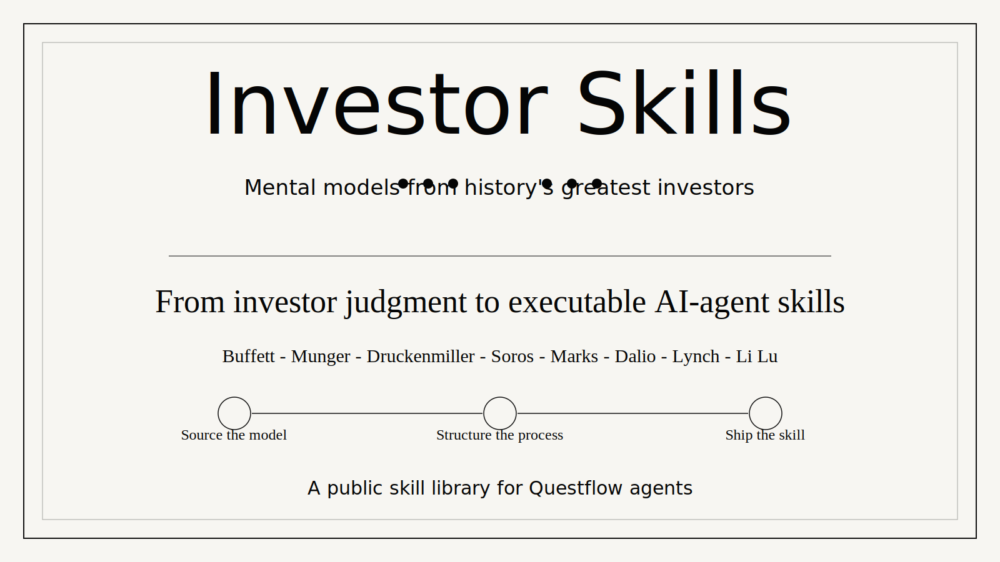

# Investor Skills



Open-source mental models from top investors, translated into practical AI-agent skills.

Investor Skills is a public knowledge repo for collecting how great investors think, decide, size risk, scan markets, and act under uncertainty. The goal is not to archive quotes. The goal is to turn durable investing judgment into reusable skills that humans can study and Questflow agents can execute.

Questflow will use this repo as one source of out-of-box skills for AI agents distilled from top investors.

## Why This Exists

Most investing content is passive:

- interviews
- letters
- podcasts
- books
- market commentary

But the useful part is operational:

- What does this investor notice before others?
- What questions do they repeatedly ask?
- What data do they trust?
- What do they ignore?
- When do they act?
- How do they size conviction?
- What would their agent scan for every day?

This repo exists to extract those mental models into a format that can become software.

## What Belongs Here

Each investor skill should capture a repeatable decision pattern from a top investor.

Good examples:

- Warren Buffett: business quality, moat durability, capital allocation, margin of safety
- Charlie Munger: inversion, incentives, multidisciplinary filters, avoiding stupidity
- Stanley Druckenmiller: liquidity, narrative inflection, asymmetric macro bets
- George Soros: reflexivity, crowd feedback loops, boom-bust structure
- Howard Marks: cycle positioning, risk temperature, second-level thinking
- Ray Dalio: regime mapping, debt cycles, portfolio balance
- Peter Lynch: consumer observation, simple growth stories, earnings follow-through
- Li Lu: owner mindset, durable compounding, downside-first underwriting
- Joel Greenblatt: special situations, return on capital, valuation discipline

## Skill Format

Use this structure for each skill:

```md
# Investor Name - Skill Name

## Core Mental Model
One clear idea the investor uses to see markets differently.

## When To Use
The market condition, asset type, or decision context where this model is useful.

## Inputs
Data, signals, documents, or observations needed.

## Process
Step-by-step reasoning pattern.

## Output
What the skill should produce: ranking, watchlist, signal, thesis, warning, trade idea, or risk note.

## Failure Modes
Where this mental model breaks or gets overused.

## Source Notes
Books, letters, interviews, talks, filings, or credible references.
```

## Questflow Direction

Questflow is building a decentralized agentic brokerage where users can trade and invest through AI agents distilled from top investors.

This repo supports that product direction in three ways:

1. **Distribution** - public investor mental models are useful on their own and can attract builders, investors, and curious users.
2. **Product supply** - the best entries can become out-of-box Questflow agent skills.
3. **Trust** - transparent source notes make the skill library easier to inspect, debate, and improve.

Questflow's position: we are the brain, not the vault. Users keep custody with their broker or wallet. Questflow focuses on market reasoning, proactive scanning, and conversation-driven execution.

## Roadmap

- Add first 10 investor mental model entries.
- Standardize the skill schema.
- Tag skills by asset class, time horizon, signal type, and risk style.
- Convert the best mental models into executable Questflow agent skills.
- Build public examples of daily scans generated from these skills.

## Contributing

Contributions should be practical, sourced, and operational.

Please avoid:

- generic biographies
- unsourced quotes
- motivational summaries
- vague investing advice

Prefer:

- repeatable decision frameworks
- concrete input signals
- clear failure modes
- primary or credible secondary sources
- examples that could become an AI-agent workflow

## License

To be decided.
