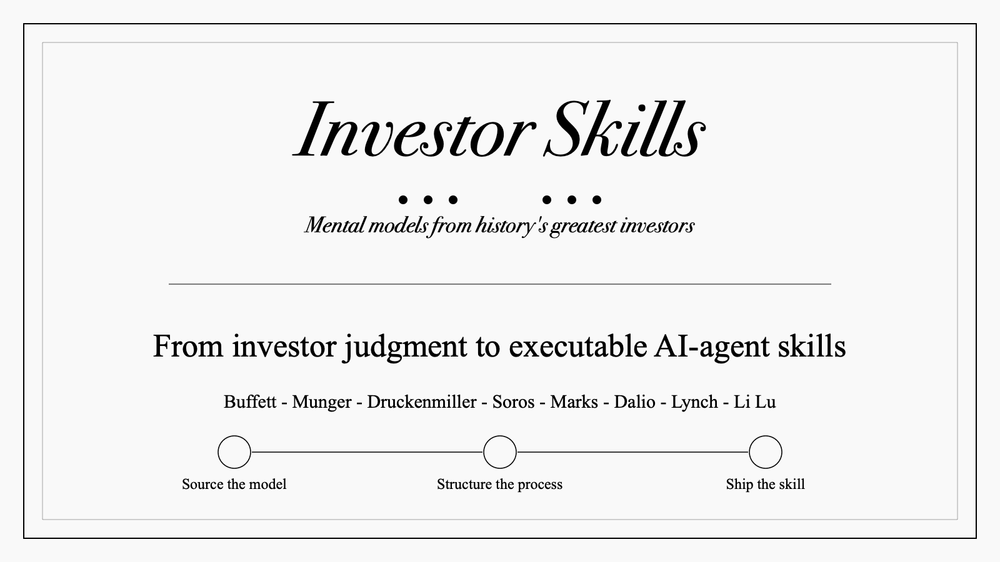

# Investor Skills

**Investor Skills are portable judgment systems for AI finance agents.**

Run these investor skills inside [Questflow](https://questflow.ai), the AI Finance Agent for financial markets.

[Investor Skill Template](templates/skill.template.md) · [Investment Schema](docs/spec.md) · [Templates](templates/) · [Examples](examples/) · [Contributing](#contributing)

Investor Skills is an open-source library that turns durable investing judgment into portable, structured formats. It collects how great investors think, filter opportunities, size risk, and act under uncertainty — then structures those patterns so humans can study them and AI finance agents can apply them.

It is also a public template layer for Questflow-style AI Finance Agents: top investor judgment becomes skills that can explain, monitor, size, invalidate, and execute within explicit risk rules.

## Built For Questflow, Portable Everywhere

Investor Skills are plain-text skill packages. You can use them in Claude Code, Codex, Cursor, OpenCode, or any other agent harness that can read `SKILL.md` instructions.

They are tailored for Questflow's financial harness: models, skills, plugins, and execution accounts working together across market data, portfolio context, broker/exchange/wallet permissions, and fund workflows.

This repo contains the open-source templates and example skills. Questflow also includes additional investor skills and execution-ready workflows that are not open-sourced and can be found inside the product.

[Run these skills in Questflow](https://questflow.ai)

## Investor Skill Packages

An **Investor Skill** is one agent skill package. It can embed or reference a structured investment judgment system.

```text
skills/livermore/
├── SKILL.md    # when to use, inputs, process, output, guardrails
└── invest.md   # optional investment system schema: signals, filters, sizing, risk
```

For simple skills, put the investment system directly inside `SKILL.md`. For larger or reusable models, keep it as `invest.md` and reference it from the skill frontmatter.

### SKILL.md — The Agent Entry Point

`SKILL.md` is the public interface of an investor skill. It tells the agent when to use the model, what inputs are required, how to apply the process, what to avoid, and how to format the answer.

```yaml
---
name: buffett
description: Use when evaluating a business through Buffett-style ownership, moat, owner earnings, and margin-of-safety judgment.
invest: ./invest.md
---
```

Use [`templates/skill.template.md`](templates/skill.template.md) to create new packaged skills.

### Investment Schema — The Judgment System

The investment schema is the structured judgment system inside an investor skill. It defines the investor's worldview, universe, market regime, signals, filters, sizing, risk, monitoring, and playbooks.

[`docs/spec.md`](docs/spec.md) documents the optional standalone `INVEST.md` format for teams that want to store the investment system as a separate file. Conceptually, `INVEST.md` is not a separate product from skills; it is the investment schema used inside investor skills.

An INVEST.md file combines:

- **YAML tokens** (machine-readable): signals, filters, sizing rules, risk parameters, key metrics
- **Markdown prose** (human-readable): philosophy, analysis process, execution rules, behavioral guardrails

```yaml
---
version: alpha
name: Buffett/Munger Value Investing
slug: buffett-munger-value
style: value+quality
timeHorizon: 5-10 years
decisionCadence: quarterly
assetClasses:
  - public equities
universe:
  marketCap: large-cap
  liquidity: high
marketRegime:
  preferred: any
  posture: patient
signals:
  fundamental:
    roic:
      weight: high
      frequency: annual
      direction: higher-is-better
      threshold: "> 15%"
filters:
  durableMoat: required
  consistentFCF: required
sizing:
  maxPosition: 25%
  maxPortfolio: 15
risk:
  marginOfSafety: 30%
  stopLoss: none
---
```

See the [full specification](docs/spec.md) and [example](examples/buffett.invest.md).

### Templates — Copyable Starting Points

Use these when adding a new investor model:

| Template | Purpose |
|---|---|
| [`templates/skill.template.md`](templates/skill.template.md) | Defines the investor skill package: triggers, inputs, process, output format, guardrails, and Questflow use |
| [`templates/invest.template.md`](templates/invest.template.md) | Optional schema file for larger models: worldview, universe, market regime, signals, filters, sizing, risk, monitoring, playbooks, and sources |

The optimized template adds fields that matter for real investor agents: `assetClasses`, `universe`, `marketRegime`, `decisionCadence`, signal `frequency`, and `sources`.

## Repo Structure

```
investorskills/
├── docs/
│   └── spec.md              # Optional investment schema specification
├── examples/
│   └── buffett.invest.md    # Standalone investment-system example
├── templates/
│   ├── skill.template.md    # Copyable investor skill package template
│   └── invest.template.md   # Optional investment schema template
├── skills/
│   └── <skill-name>/        # Agent skill package
│       ├── SKILL.md
│       └── invest.md        # Optional, referenced by SKILL.md
├── README.md
└── LICENSE
```

## Quick Start

### Use an investor skill

Copy a skill package into your agent's skills directory. The `SKILL.md` file is the entry point; any linked `invest.md` file is supporting schema.

### Create a new investor skill

```bash
mkdir -p skills/livermore
cp templates/skill.template.md skills/livermore/SKILL.md
cp templates/invest.template.md skills/livermore/invest.md
```

Then replace the placeholders with the investor's actual judgment system: triggers, universe, regime, signals, filters, sizing, risk, monitoring, playbooks, and sources.

### Install as a skill

Install all packaged skills or a single skill:

```bash
# Install all skills
npx skills add https://github.com/xuboyuebobb/investorskills

# Install a single skill
npx skills add https://github.com/xuboyuebobb/investorskills --skill "livermore"
```

### Use standalone

Copy any `SKILL.md` into ChatGPT, Codex, Cursor, Claude, or another agent conversation. If the skill references `invest.md`, include that file too.

## Investment Schema Examples

| File | Investor | Style | Description |
|---|---|---|---|
| [`buffett.invest.md`](examples/buffett.invest.md) | Buffett, Munger, Graham | value+quality | Long-term ownership of durable businesses bought below intrinsic value |

## Available Skills

| Skill | Investor | Model |
|---|---|---|
| [`livermore`](skills/livermore/) | Jesse Livermore | Trend following, breakout confirmation, pyramiding, and strict loss cutting |
| [`oneil-canslim`](skills/oneil-canslim/) | William O'Neil | Earnings acceleration, relative strength, institutional demand, and clean base breakouts |
| [`buffett`](skills/buffett/) | Warren Buffett | Durable business ownership, owner earnings, moat, management quality, and margin of safety |
| [`munger`](skills/munger/) | Charlie Munger | Mental models, inversion, incentives, quality filters, and concentrated decisions |
| [`marks-cycles`](skills/marks-cycles/) | Howard Marks | Second-level thinking, credit cycles, risk premiums, and defensive/aggressive posture |
| [`soros-reflexivity`](skills/soros-reflexivity/) | George Soros | Reflexivity, macro dislocations, feedback loops, and asymmetric risk windows |
| [`druckenmiller`](skills/druckenmiller/) | Stanley Druckenmiller | Top-down macro, liquidity regimes, concentrated risk-taking, and quick loss cutting |
| [`darvas-box`](skills/darvas-box/) | Nicolas Darvas | New-high momentum, box breakouts, volume confirmation, and mechanical stops |
| [`ansem-crypto`](skills/ansem-crypto/) | Ansem | Crypto portfolio structure, L1/app-token theses, attention, narratives, comparative valuation, TA+FA, and retail-flow reflexivity |
| [`serenity`](skills/serenity/) | Serenity / @aleabitoreddit | AI and semiconductor supply-chain chokepoints, upstream bottleneck mapping, institutional rotation, and dilution-aware thesis validation |
| [`minervini-vcp`](skills/minervini-vcp/) | Mark Minervini | VCP pattern, stage-2 trend, volatility contraction, tightness, pivot breakout, and fast loss cutting |
| [`burry-asymmetric-contrarian`](skills/burry-asymmetric-contrarian/) | Michael Burry | Primary-source contrarian longs/shorts, complex mispricing, asymmetric payoff, and catalyst/carry risk |
| [`simons-quant`](skills/simons-quant/) | Jim Simons / Renaissance | Quant signal research, many weak edges, statistical validation, execution cost, and signal decay |
| [`lynch-growth`](skills/lynch-growth/) | Peter Lynch | Understandable growth stocks, company classification, PEG discipline, balance sheet, and story monitoring |
| [`klarman-deep-value`](skills/klarman-deep-value/) | Seth Klarman | Deep value, distressed assets, forced sellers, illiquidity discounts, and downside protection |
| [`greenblatt-special-situations`](skills/greenblatt-special-situations/) | Joel Greenblatt | Spinoffs, restructurings, merger securities, forced selling, and quality-value special situations |
| [`tepper-distressed-macro`](skills/tepper-distressed-macro/) | David Tepper | Distressed macro, bank/credit stress, capital structure, policy backstops, and recovery asymmetry |
| [`ptj-macro-trend`](skills/ptj-macro-trend/) | Paul Tudor Jones | Macro trend, turning points, technical confirmation, liquidity, and strict drawdown control |
| [`seykota-systematic-trend`](skills/seykota-systematic-trend/) | Ed Seykota | Systematic trend following, mechanical rules, volatility sizing, whipsaw tolerance, and discipline |
| [`turtle-trading`](skills/turtle-trading/) | Richard Dennis / Turtles | Donchian breakouts, ATR/N-unit sizing, pyramiding, stops, and portfolio heat control |
| [`icahn-activist`](skills/icahn-activist/) | Carl Icahn | Activist investing, governance pressure, capital allocation fixes, asset sales, and control catalysts |
| [`li-lu-value`](skills/li-lu-value/) | Li Lu | Circle of competence, deep research, downside protection, global quality value, and concentrated ownership |
| [`nick-sleep-scale-economies`](skills/nick-sleep-scale-economies/) | Nick Sleep / Qais Zakaria | Scale economies shared, customer-value flywheels, owner culture, low turnover, and long-duration compounding |

## Contributing

### Adding an investor skill

1. Create `skills/<skill-name>/SKILL.md`
2. Use [`templates/skill.template.md`](templates/skill.template.md)
3. Embed the investment judgment system in `SKILL.md`, or add `skills/<skill-name>/invest.md` for larger models
4. Define when to use, inputs, process, output format, and guardrails
5. Add an entry to the Available Skills table above

### Adding a standalone investment schema example

1. Create `<name>.invest.md` in `examples/`
2. Follow the [investment schema specification](docs/spec.md)
3. Include YAML frontmatter with tokens and markdown body with rationale
4. Add an entry to the Investment Schema Examples table above

### Planned models

- `lynch.invest.md` — Peter Lynch: invest in what you know, PEG ratio, stock categories
- `dalio.invest.md` — Ray Dalio: all-weather, risk parity, macro regime identification
- `simons.invest.md` — Jim Simons: quantitative, statistical arbitrage, signal processing
- `greenblatt.invest.md` — Joel Greenblatt: magic formula, special situations, spinoffs
- `templeton.invest.md` — John Templeton: contrarian, global, maximum pessimism

## Why

Most investing content is passive: books, interviews, letters, podcasts, clips, and commentary.

The useful part is operational:

- What does this investor notice before others?
- What questions do they ask every time?
- What data do they trust?
- What do they ignore?
- What makes them act?
- What would their agent scan for every day?

Investor Skills extracts those decision patterns into software-shaped instructions.

## Relationship to DESIGN.md

[DESIGN.md](https://github.com/google-labs-code/design.md) gives AI agents a persistent understanding of a **visual identity** — colors, typography, layout, components.

Investor Skills give AI finance agents a persistent understanding of an **investment judgment system** — triggers, signals, filters, analysis, sizing, risk, monitoring, and playbooks.

Like DESIGN.md, the optional investment schema uses YAML tokens (machine-readable parameters) plus markdown prose (human-readable rationale). The full skill package stays plain-text, version-controllable, and agent-portable.

## License

MIT
